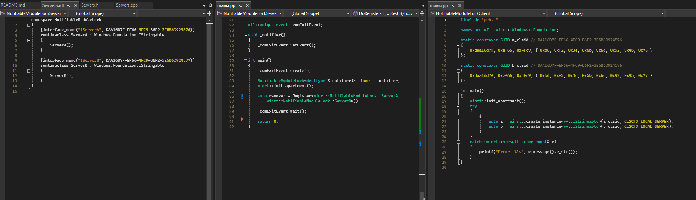

# Pure CppWinRT Out-Of-Proc COM Server without WRL Demo

## Features

1. Automatic shutdown
2. WinRT-as-COM Server registration based on variadic template instead of marcro
3. No WRL (rightfully so)
 

## Quick Start

1. Open solution in VS
2. Launch Server. It should stay opened
3. Launch client while server is running by right-clicking client project -> Debug -> Start new instance
4. Observe server shuts down

## Motivation

There has been ask for out-of-proc, non-DLL COM server support with pure cppwinrt for a long time. The above screenshot comes from https://github.com/microsoft/cppwinrt/issues/601. Many people expressed interest, but that thread went nowhere.

Expectedly, cppwinrt wants to maintain its focus on only projection/consumption/authoring. IMO that is a good call. But that doesn't change the fact that this ask is left unfulfiled. And people always have to go back to WRL as it just works™️.

This sample demonstrates how with simple additions, out of proc cppwinrt COM server without WRL is possible.

This sample has two goals:
1. Make these classes into WIL (Windows Implementation Library). The API might need some tweak but the concept works.
2. Update all `IExploerCommand` and `IWidgetProvider` sample to use only cppwinrt + WIL instead of WRL. Let WRL stay in the past.

Subsequently, I hope that powertoys etc would pick up the momentum and migrate to cppwinrt + WIL for its `IExplorerCommand` context menu implementation.

## How it works

1. cppwinrt expose a configuration `WINRT_CUSTOM_MODULE_LOCK` that allows users to hook into the module lock mechanism
2. Write a custom module lock which, (a) notifies when module count reaches 0, and (b) provides customization point for the notification
3. cppwinrt also provides `winrt::no_module_lock` so that class factory implementation can be omitted from module object count
4. Write variadic functions that take in authored type and register class factory recursively